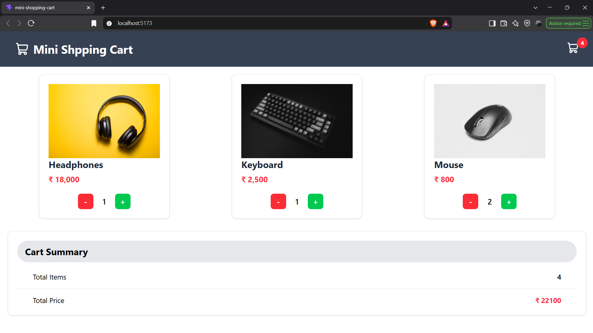

# Mini Shopping Cart

A simple React shopping cart for browsing tech products, changing item quantities, and viewing the cart's item count and total price.

## Screenshot



## Features

- Product cards with images and prices
- Increase or decrease each product's quantity
- Quantities cannot go below zero
- Cart header and summary show the total item count and price

## Tech Stack

- React
- Vite
- Tailwind CSS
- Lucide React

## Getting Started

Install dependencies and start the development server:

```bash
npm install
npm run dev
```

## Scripts

- `npm run dev` starts the development server.
- `npm run build` creates a production build in `dist/`.
- `npm run preview` serves the production build locally.
- `npm run lint` runs Oxlint.
