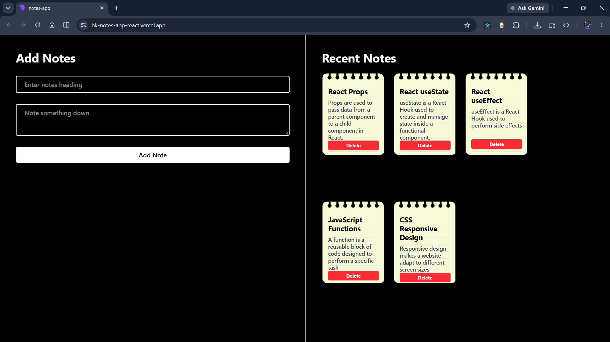

# Notes App

A lightweight notes app built with React. Add a note with a heading and details, view your notes as sticky-note cards, and remove notes when they are no longer needed.

**Live demo:** [bk-notes-app-react.vercel.app](https://bk-notes-app-react.vercel.app/)



## Features

- Create notes with a title and written details.
- Browse notes in the Recent Notes area.
- Delete individual notes.
- Responsive split-panel layout on larger screens.

> Notes are stored in React component state only. They are cleared when the page is refreshed; this version does not use browser storage or a backend.

## Getting Started

You will need [Node.js](https://nodejs.org/) and npm installed.

1. Clone this repository and open the `notes-app` directory:

   ```bash
   cd notes-app
   ```

2. Install dependencies:

   ```bash
   npm install
   ```

3. Start the development server:

   ```bash
   npm run dev
   ```

   Open the local URL printed in the terminal.

## Available Scripts

| Command           | Description                           |
| ----------------- | ------------------------------------- |
| `npm run dev`     | Start the Vite development server.    |
| `npm run build`   | Create a production build in `dist/`. |
| `npm run preview` | Preview the production build locally. |
| `npm run lint`    | Run Oxlint.                           |

## Tech Stack

- React 19
- Vite
- Tailwind CSS 4
- Oxlint
