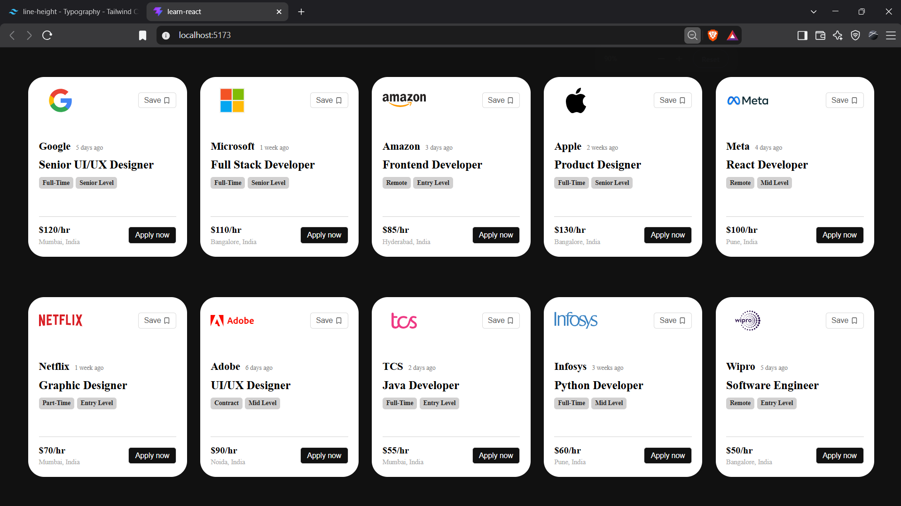

# Job Listings: React Props Practice

A small React application that displays job listings as reusable cards. It demonstrates passing data to a component through props: `App` iterates over the jobs dataset and passes each listing to `Card` through its `job` prop.

## Requirements

- Node.js 20.19+ or 22.12+
- npm

## Getting Started

From this directory, install dependencies and start the Vite development server:

```bash
npm install
npm run dev
```

Open the local URL printed by Vite in your browser.

## Screenshots



## Available Commands

| Command           | Description                                                         |
| ----------------- | ------------------------------------------------------------------- |
| `npm run dev`     | Start the development server with hot module replacement.           |
| `npm run build`   | Create a production build in `dist/`.                               |
| `npm run preview` | Serve the production build locally after running the build command. |
| `npm run lint`    | Run Oxlint on the project.                                          |

## How It Works

The listings are defined as an array in `src/Data/jobs.js`. `src/App.jsx` maps over the array, assigns each listing's `id` as its React key, and renders a `Card` with the listing passed as a prop. `src/components/Card.jsx` displays the company, role, tags, pay, location, and posting date. The card layout is styled in `src/components/Card.css`.

To add or change a listing, edit the jobs array. Each listing uses these fields:

| Field          | Purpose                                 |
| -------------- | --------------------------------------- |
| `id`           | Unique key for rendering the listing.   |
| `company`      | Company name and logo alternative text. |
| `logo`         | Company logo URL.                       |
| `posted`       | How long ago the job was posted.        |
| `role`         | Job title.                              |
| `tag1`, `tag2` | Employment type and experience level.   |
| `rate`         | Displayed pay rate.                     |
| `location`     | Job location.                           |

Company logos are loaded from external URLs, so they require an internet connection. The Save and Apply now buttons are visual controls only; they are not connected to application behavior or a backend.

## Project Structure

```text
src/
	App.jsx                 Renders the list of job cards
	main.jsx                React application entry point
	index.css               Global reset styles
	Data/
		jobs.js               Sample job listing data
	components/
		Card.jsx              Reusable job listing card
		Card.css              Job card and listing layout styles
```

## Built With

- React 19
- Vite 8
- lucide-react for the bookmark icon
- Oxlint
