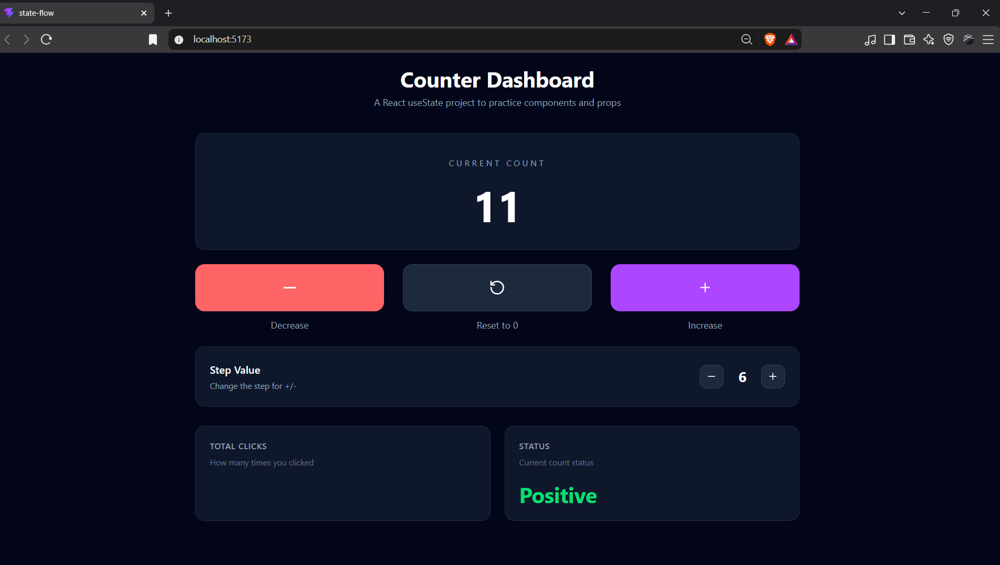

# State Flow

A React counter dashboard for practicing `useState`, component composition, props, and state flow.

## Live Demo

[View the live app](https://react-state-flow.vercel.app/)

## Screenshot



## Run locally

```bash
npm install
npm run dev
```
