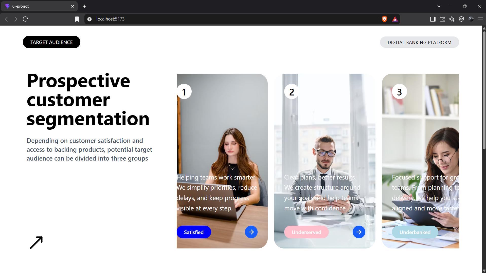

# Target Audience UI

A React UI project for a digital banking platform's target-audience section. It presents audience messaging in horizontally scrollable image cards and demonstrates **props drilling**: data is passed through several components to reach the component that renders it.

## Live Demo

[View the live app](https://ui-project-zeta.vercel.app/)

## Screenshot



## Getting Started

Requirements: Node.js 20.19+ or 22.12+ and npm.

Install dependencies and start the Vite development server:

```bash
npm install
npm run dev
```

Open the local URL printed by Vite. Audience images are loaded from Unsplash and require an internet connection.

## Available Commands

| Command           | Description                                               |
| ----------------- | --------------------------------------------------------- |
| `npm run dev`     | Start the development server with hot module replacement. |
| `npm run build`   | Create a production build in `dist/`.                     |
| `npm run preview` | Serve the production build locally after building.        |
| `npm run lint`    | Run Oxlint on the project.                                |

## Props Drilling

`App.jsx` defines a `users` array. Each object contains an image URL (`img`), introductory text (`intro`), audience label (`tag`), and button color (`color`). The array is passed down through the component tree until the card content needs it:

```text
App
└── Section1 (users)
		└── Page1Content (users)
				└── RightContent (users)
						└── RightCard (individual user fields)
								└── RightCardContent (display fields)
```

`RightContent` maps over the array to render a `RightCard` for each audience. The card forwards the display values to `RightCardContent`, which renders the introductory copy, label, and buttons. This is props drilling: intermediate components pass props along even when they do not use all of the data themselves.

## Styling

The interface uses Tailwind CSS 4 utility classes rather than component-specific CSS files. Tailwind is imported from `src/index.css`, and the `@tailwindcss/vite` plugin is configured in `vite.config.js`. The same stylesheet includes a small custom rule to hide the horizontal card scroller's scrollbar.

## Project Structure

```text
src/
	App.jsx                         Audience data and page composition
	main.jsx                        React entry point
	index.css                       Tailwind import and global scrollbar rule
	assets/
		screenshot.png                UI screenshot
	components/
		Section1/
			Section1.jsx                First page section and navbar
			Page1Content.jsx            Left and right content layout
			LeftContent.jsx             Left-side messaging
			RightContent.jsx            Horizontal audience card list
			RightCard.jsx               Audience image card
			RightCardContent.jsx        Text and controls layered on the card
		Section2/
			Section2.jsx                Placeholder second section
```

`Section2` is currently a dark placeholder section. The project does not include backend or data-fetching behavior; audience content is hard-coded in `App.jsx`.

## Built With

- React 19
- Vite 8
- Tailwind CSS 4 with `@tailwindcss/vite`
- lucide-react icons
- Oxlint
